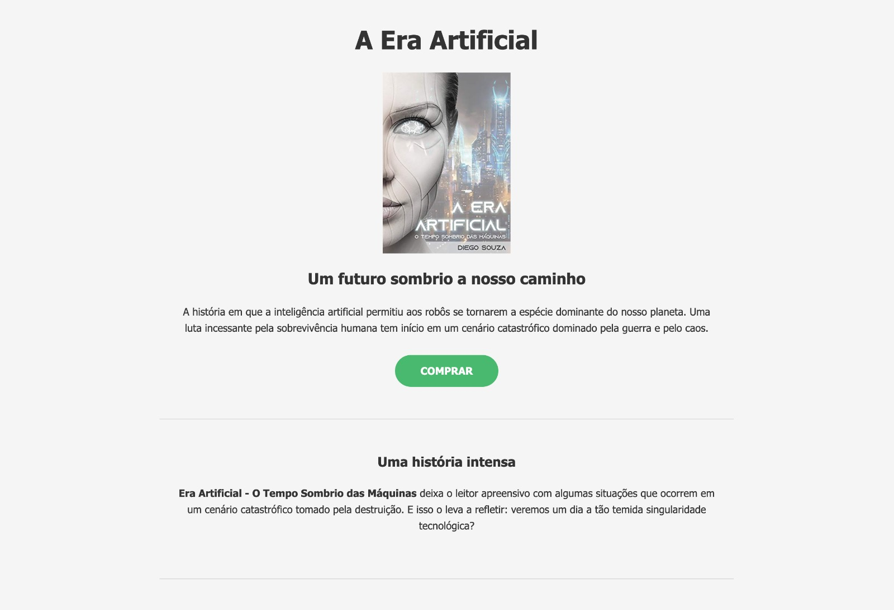
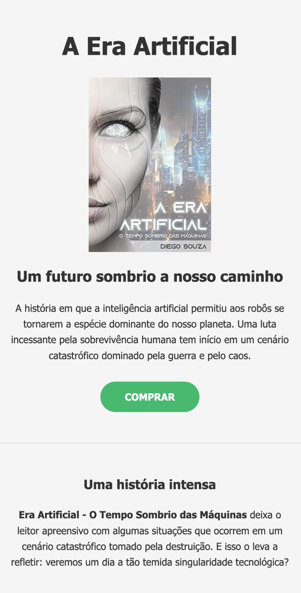

# 🤖 A Era Artificial - Landing Page

> [!NOTE]
> **Projeto de Portfólio:** Este repositório foi desenvolvido como um projeto prático de avaliação para o curso de Desenvolvimento Web da [DevMedia](https://devmedia.com.br). O código original passou por um processo de refatoração para aplicar as melhores práticas do mercado.

Uma landing page limpa, moderna e totalmente responsiva desenvolvida para a divulgação e venda do livro de ficção científica **"A Era Artificial: O tempo sombrio das máquinas"**, do autor Diego Souza.

O projeto apresenta de forma organizada a sinopse do livro, detalhes biográficos sobre o autor e links de conversão direta para a compra do eBook na Amazon.

---

## 📱 Demonstração do Projeto

Aqui você pode ver o visual da landing page renderizada tanto em computadores quanto em dispositivos móveis:

  <table>
    <tr>
      <td align="center" width="60%">
        <b>💻 Versão Desktop</b>  
        
      </td>
      <td align="center" width="40%">
        <b>📱 Versão Mobile</b>  
        
      </td>
    </tr>
  </table>

## 🚀 Tecnologias e Conceitos Aplicados

O projeto foi construído utilizando tecnologias fundamentais da web, focando em práticas modernas de arquitetura front-end:

- **HTML5 Semântico:** Substituição de contêineres genéricos por tags semânticas (`<header>`, `<main>`, `<section>`, `<footer`, `<strong>`) para melhorar a acessibilidade e o SEO.
- **CSS3 Moderno:**
  - Uso do modelo de caixa avançado com `box-sizing: border-box`.
  - Implementação de **Design Responsivo** utilizando `max-width` e porcentagens para garantir compatibilidade perfeita com celulares, tablets e desktops.
  - Adicionados efeitos de micro-interação como transições suaves (`transition: ease`) no estado `:hover` dos botões.

## 📝 Funcionalidades em Destaque

- **Seção Hero:** Apresentação de alto impacto com a capa do livro e sinopse principal.
- **Storytelling:** Blocos de leitura estratégica sobre a narrativa e informações sobre o autor.
- **Call to Action (CTA):** Botões fluidos de chamada para ação vinculados diretamente à loja da Amazon Brasil.
- **Layout Mobile-First / Responsivo:** Experiência de leitura fluida que não quebra em telas menores.

## 👤 Desenvolvedor

- **Eilincoln** — [@eilincoln](https://github.com/eilincoln)
